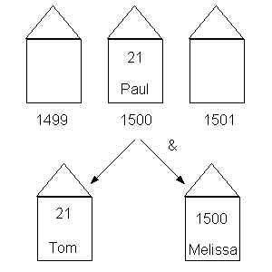
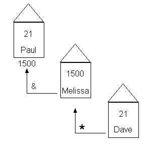
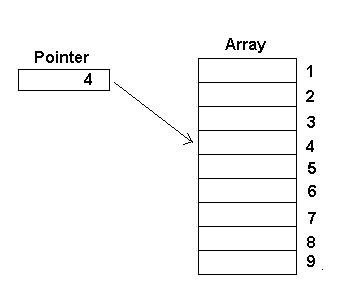

## Chapter 9: Strings & Vectors

Instructor: Mark Edmonds

<edmonds_mark@smc.edu>

## Pointers

- A **pointer** is a value that designates the address of some value.
- Pointers are variables that hold a memory location as their value
- The address-of operator (`&`) will return the address (memory location) of a variable
  - This operator gets the address of the operand
- Pointers give us a way to save the result of the address-of operator into a variable
  - The type returned by the address-of is a pointer!
- If you are familiar with C, pointers in C++ are identical to pointers in C

## Assigning and dereferencing pointers

- We save pointers into variable

```cpp
int a = 5;       // declare & initialize an int to the value of 5
int *b = &a;     // declare & initialize a pointer to store the address of the variable a
```

- At this point, `b` doesn't store the value 5. It stores the memory address of the variable `a`. The variable `a` stores the value 5, not `b`.
- But how can we access the value of `a` using the pointer `b`?
  - We use the **dereferencing operator** (`*`) to tell the computer "take me to the memory location stored by this pointer":

```cpp
int a = 5;       // declare & initialize an int to the value of 5
int *b = &a;     // declare & initialize a pointer to store the address of the variable a
int c = *b;      // declare & initialize an int to the value of the dereferenced b, which is the value stored by a
```

- The dereference operator (`*`) is the complement to the address-of operator (`&`), similar to how subtraction is the complement to addition

## House analogy

- We are all familiar with houses and the address system we use with the post office
- This is a great parallel to pointers in C++.
- We can think of variables as houses (a very large box to store data in - but we won't worry about the size of the house right now).
- We can think of memory address as addresses
  - Do addresses have houses of their own? NO!
  - But when we declare a pointer, we make a house specifically to store an address
- Lets think about some questions using the analogy
- (credit to [http://alumni.cs.ucr.edu/~pdiloren/C++_Pointers/wherelive.htm](http://alumni.cs.ucr.edu/~pdiloren/C++_Pointers/wherelive.htm) for this analogy and these figures)

### Where do you live? (`&`)

- Suppose we have the following code:

```cpp
int paul = 21;        // store the value 21 in paul's house
int tom = paul;       // store the value in paul's house in tom's house (makes a copy)
int *melissa = &paul; // store address of paul in melissa's house
```

- And suppose paul's address is 1500.
- What is the value stored in melissa's house?
  - 1500
  - melissa's house stores a pointer
- Let's look at this as a diagram:



### What's in your house? (`*`)

- Suppose we continue our example above and write the following:

```cpp
int dave = *melissa; // stores the value 21 in dave's house
```

- How did 21 get into dave's house?
  - Dave asks melissa what value she is storing.
  - Melissa tell's dave "1500".
  - Dave knows melissa's house stores a pointer, so he then goes to the address 1500 and ask whoever is there what value is inside (notice, dave doesn't know that 1500 is paul's house)
  - Dave then stores 21 in his house



- Now suppose we execute the following line:

```cpp
*melissa = 30;
```

- How do the houses update?
  - paul's house is updated to store 30
  - melissa's house stays the same
  - dave's house stays the same
    - dave lives in a different house than paul, and the contents of dave's house don't change when the contents of paul's house change

## NULL pointers

- For most variable types, we have a default value we typically use by default. For instance, 0 is the default type for `int`.
- Pointers have no explicit default type (meaning will value will be garbage if you do not initialize the pointer when you declare it).
- We use a special marco (preprocessor definition) called `NULL` to indicate that this pointer does not point to any memory address:

```cpp
int *ptr = NULL; // does not point to anything
//now we can check if the pointer is safe to dereference (because it actually points to something)
if(ptr != NULL){
  *ptr = 5; // safe to dereference
}
```

- Starting in C++11, we can also use `nullptr` instead of `NULL`

```cpp
int *ptr = nullptr; // does not point to anything
//now we can check if the pointer is safe to dereference (because it actually points to something)
if(ptr != nullptr){
  *ptr = 5; // safe to dereference
}
```

- If we don't make sure we properly initialize a pointer to a memory address

## Stress-testing your understanding of pointers

- What if we wanted a pointer to a pointer that points to an int?
  - This means the data type of this variable/house would point to a memory address that points to the memory address of an int

```cpp
int a = 5;
int *ptr = &a;
int **ptr2ptr = &ptr;
```

- We can continue doing this over and over to get "deeper" into what points to what
- Consider this complicated example:

```cpp
int *p1, *p2, **p3, a = 5, b = 10;
p1 = &a;
p2 = &b;
p3 = &p2;
*p1 = 10;
p1 = p2;
*p1 = 20;
**p3 = 0;
cout << *p1 << " " << *p2 << " " << **p3 << " " << a << " " << b << endl;
Answer:
0 0 0 10 0
```

## Arrays and pointers

- Arrays represent contiguous blocks of computer memory. Each element of an array is placed immediately next to the preceding/next element of the array in memory.
- Pointers and arrays are deeply and somewhat confusingly linked. There's two basic rules:

1. A variable declared as an array of some type acts as a pointer to that type. When used by itself, it points to the first element of the array.
2. A pointer can be indexed like an array name. We can use `[]` with pointers the same way we use array names.

- Array names can be thought of as constant pointers, meaning the address they store cannot change, but the contents at that address can change
  - `int *const const_ptr` creates a constant pointer to a non-constant int
  - There's a nifty trick called the 'backwards spiral rule' that makes reading these declarations a lot easier (you don't need to know/study this, just providing for additional info) [http://c-faq.com/decl/spiral.anderson.html](http://c-faq.com/decl/spiral.anderson.html)



### Arrays as pointers

- This occurs primarily when arrays are passed into/returned from functions (remember how we returned an array from a function? We used a pointer).

```cpp
 /* two equivalent function definitions */
 int func(int *paramN);
 int func(int paramN[]);
```

- Pointers and array names can be used almost interchangeably. There are a few exceptions/things to keep in mind:
    1. You cannot assign a new pointer value to an array name (since the array name is a constant value, and therefore immutable/non-modifiable).
    2. The array name will always point to the first element of the array.

### Pointer arithmetic

- We can add/subtract integer values from pointers. This is called **pointer arithmetic**.
- This is relevant for iterating over arrays using a pointer and pointer arithmetic
- The following two expressions are equivalent:

```cpp
*(arr+j)  // access element using pointer arithmetic
arr[j];   // access element using [] operator
```

- What does the first expression do?
  - Adds `j*sizeof(arr type)` to arr, and then dereferences that memory location
  - For instance, if we have an array of `int`s, each array element is 4 bytes long.
  - If `arr` starts at address 3500, the 5th element is located at memory address 3500+(5*sizeof(int)).
  - Notice the `sizeof()` was not explicit, the compiler will automatically multiply `j` by the size of each member of the array
- Consider the following (figures, etc taken from [here](https://www.eskimo.com/~scs/cclass/notes/sx10b.html)):

```cpp
int *ip;
int a[10];
ip = &a[3];
```

- `ip` would end up pointing to the forth element of `a`.


- Now suppose we wrote

```cpp
ip2 = ip + 1;
```

- Then we'd have:


#### Knowledge check

```cpp
#include <iostream>

using namespace std;

int main()
{
  int array [5] = { 9, 7, 5, 3, 1 };

  cout << (void*) &array[1] << endl; // print memory address of array element 1, must cast to void pointer to print
  cout << (void*) (array+1) << endl; // print memory address of array pointer + 1

  cout << array[1] << endl; // prints 7
  cout << *(array+1) << endl; // prints 7 (note the parenthesis required here)

  return 0;
}
```

#### Iteration using pointer arithmetic

- We can use pointer arithmetic to iterate over an array, instead of using integer indices

```cpp
const size_t arr_len = 7;
char name[arr_len] = "Mollie";
int numVowels(0);
// initialize the pointer to the beginning of the array
// condition is whether or not the pointer has past the last valid memory address for the array (name + arr_len)
// loop statement incrementing the pointer to the next element in the array
for (char *ptr = name; ptr < name + arr_len; ++ptr)
{
  switch (*ptr)
  {
    case 'A':
    case 'a':
    case 'E':
    case 'e':
    case 'I':
    case 'i':
    case 'O':
    case 'o':
    case 'U':
    case 'u':
        ++numVowels;
  }
}
```

## Pointers and Pass-by-reference

- In C++, we can also effective pass-by-reference by passing a pointer to a variable.
  - In the callee function, dereferencing the pointer will effectively give us access to the variable in the caller.
- Consider the following pass-by-value, then we will look at passing-by-reference using pointers

```cpp
#include <iostream>

using namespace std;

int dummy_func(int param){
  // this modification doesn't affect the variable that was passed into the function
  param++;
  return param;
}

int main(){
  int a = 5;
  int b = dummy_func(a); // a is copied to dummy_func
  // since a was copied (and then the copied value was modified in dumm_func, then returned), the value of a in main does not change
  cout << "a: " << a << ", b: " << b << endl;
}
```

- Remember: pointers are just memory addresses.
- If you copy a pointer, the memory location says the same.
- This means we can create pass-by-reference behavior by passing pointers to functions
  - The pointers are copied into the function, but if we dereference and modify their value, we aren't changing the pointer, but the contents the pointer refers to.
  - This is essentially pass-by-reference behavior
- Let's convert our `dummy_func` to pass-by-reference using pointers:

```cpp
#include <iostream>

using namespace std;

int dummy_func(int* param){
  // this modification doesn't affect the variable that was passed into the function
  (*param)++;
  return (*param);
}

int main(){
  int a = 5;
  int b = dummy_func(&a); // memory address of a is copied to dummy_func
  // since a was passed as a pointer, the value of a is changed in main
  cout << "a: " << a << ", b: " << b << endl;
}
```

- In the notes on arrays, we actually never needed to return the array! For instance:

```cpp
//NOTICE: the asterisk (star) next to int indicates we are returning an array
int* add_to_zeroth_element(int arr[], size_t arr_len, int value){
  // this is just a dummy array operation, in practice you'll do wonderful and amazing things here
  arr[0] += value;
  // NOTICE: return the array, we don't use [] here, just the name of the array.
  return arr;
}

void add_to_zeroth_element_no_return(int *const arr, size_t arr_len, int value){
  // this is just a dummy array operation, in practice you'll do wonderful and amazing things here
  arr[0] += value;
  // don't need to return the array, since the array is effectively passed-by-reference
}

int main(){
  int arr[] = {1,2,3};
  // notice the type here has to match the return type of the function. Exactly what's going on here will be covered with pointers.
  int* result = add_to_zeroth_element(arr, 3, 5);

  for (j = 0; j < 3; ++j)
  {
    printf("%d  ", arr[j]);
  }

  // increment once more on the first element, no return
  add_to_zeroth_element_no_return(arr, 3, 5);

  for (j = 0; j < 3; ++j)
  {
    printf("%d  ", arr[j]);
  }
}
```

<!-- ## New pointers - `unique_ptr` and `shared_ptr`

- C++11 introduced two new classes to help work with points in a more object-oriented way.
- This information is a bit more advanced, but it is good to note (so don't expect to see it mentioned much on quizzes and tests)
- The first is called `unique_ptr` and it is used when a pointer should be unique.
  - This pointer cannot be copied or assigned to another variable (ownership of the pointer can be transferred using `std::move()`)
  - It should be used when you are confident you only want to refer to a pointer a single time. -->