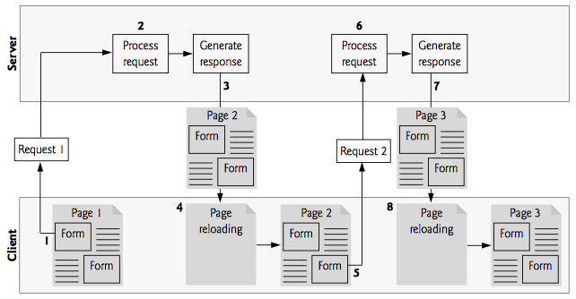
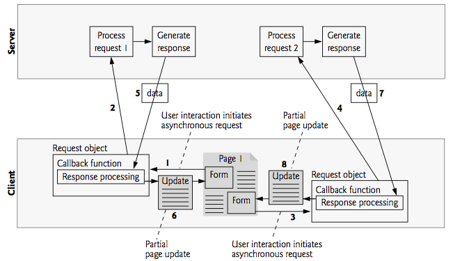
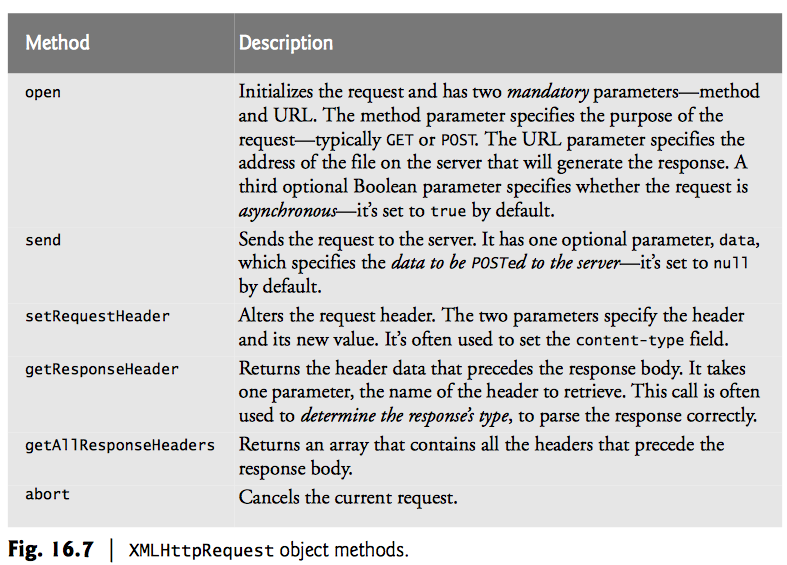

* What is Ajax?
    * **A**synchronous **J**avascript **A**nd **X**ML
        * Misleading name! Originally developed for XML, but you can transfer plain text or JSON with it as well. 
    * The idea: we load data as the user is viewing and interacting with the page; Javascript communicates with the server in the background to update the page.
    * The effect: web applications that behave much more similarly to desktop applications
    * The benefit: web applications don't have to reload a page to get new data. This can be incredibly simple data or complex data to enable drastic changes to the page
* A side note about practicality:
    * We will learn about Ajax, but running Ajax requires a webserver to respond to requests. We will eventually cover webservers which will enable us to run our own basic Ajax examples
* Some examples of Ajax:
    * [http://test.deitel.com/iw3htp5/ch16/fig16_05/SwitchContent.html](http://test.deitel.com/iw3htp5/ch16/fig16_05/SwitchContent.html)
    * [http://test.deitel.com/iw3htp5/ch16/fig16_08/PullImagesOntoPage.html](http://test.deitel.com/iw3htp5/ch16/fig16_08/PullImagesOntoPage.html)
    * [http://test.deitel.com/iw3htp5/ch16/fig16_09-10/AddressBook.html](http://test.deitel.com/iw3htp5/ch16/fig16_09-10/AddressBook.html)
    * [http://kengeddes.com/cs80/examples/ajax.html](http://kengeddes.com/cs80/examples/ajax.html)
        * [http://kengeddes.com/cs80/examples/ajax.js](http://kengeddes.com/cs80/examples/ajax.js)
    * [http://kengeddes.com/cs80/examples/ajax-b.html](http://kengeddes.com/cs80/examples/ajax-b.html)
        * [http://kengeddes.com/cs80/examples/ajax-b.js](http://kengeddes.com/cs80/examples/ajax-b.js)
    * [http://javascript.cs.lmu.edu/playground/ajax/](http://javascript.cs.lmu.edu/playground/ajax/)

* Starting of Ajax
    * "Raw" Ajax uses Javascript directly to send asynchronous requests to the server, and updates the webpage using DOM
    * There are a lot of cross-browser, cross-operating system considerations you have to handle when using raw Ajax
        * Instead, jQuery, ASP.NET Ajax, etc can provide easy-to-use cross-platform support

* `XMLHttpRequest` - object that manages the interaction between the server and the webpage (without reloading)
    * Abbreviated `XHR`

* A review of a traditional webpage


* An overview of the Ajax architecture


Steps of this process:

1) client creates XHR object
2) XHR sends a request to the server and waits for a response

* These requests are made **asynchronously**, which means the user can keep interacting with the web page while the request finishes     

3) Many things can happen here, client could interact more with the webpage, create new XHR requests, etc
4) Server replies to the request in step 2
5) Client executes a callback function, which processes the data recieved in step 4 (could modify the DOM, etc). Commonly a partial page update
* This process is asynchronous, so tracking the exact execution can be difficult. Lots of things could happen during step 3 above

Intuitive Example - Validating a form
*  We can accomplish a lot of this using the new HTML5 forms, but provides more generic form support
*  We can validate any type of form data (e.g. zip code, etc), asynchronously, as the user fills in the form. 
*  Enables a more powerful form model, you see this all the time
    
Intimidating example! 
* The basic concept: when the user puts their mouse over a textbook cover, we load that textbook's corresponding information

```html
<!DOCTYPE html>
<!-- Fig. 16.5: SwitchContent.html -->
<!-- Asynchronously display content without reloading the page. -->
<html>

<head>
  <meta charset="utf-8">
  <style type="text/css">
    .box {
      border: 1px solid black;
      padding: 10px
    }
  </style>
  <title>Switch Content Asynchronously</title>
  <script>
    var asyncRequest; // variable to hold XMLHttpRequest object
    
    // set up event handlers
    function registerListeners() {
      var img;
      img = document.getElementById("cpphtp");
      img.addEventListener("mouseover",
        function() {
          getContent("cpphtp8.html");
        }, false);
      img.addEventListener("mouseout", clearContent, false);
      img = document.getElementById("iw3htp");
      img.addEventListener("mouseover",
        function() {
          getContent("iw3htp.html");
        }, false);
      img.addEventListener("mouseout", clearContent, false);
      img = document.getElementById("jhtp");
      img.addEventListener("mouseover",
        function() {
          getContent("jhtp.html");
        }, false);
      img.addEventListener("mouseout", clearContent, false);
      img = document.getElementById("vbhtp");
      img.addEventListener("mouseover",
        function() {
          getContent("vbhtp.html");
        }, false);
      img.addEventListener("mouseout", clearContent, false);
      img = document.getElementById("vcshtp");
      img.addEventListener("mouseover",
        function() {
          getContent("vcshtp.html");
        }, false);
      img.addEventListener("mouseout", clearContent, false);
      img = document.getElementById("javafp");
      img.addEventListener("mouseover",
        function() {
          getContent("javafp.html");
        }, false);
      img.addEventListener("mouseout", clearContent, false);
    } // end function registerListeners
    
    // set up and send the asynchronous request.
    function getContent(url) {
      // attempt to create XMLHttpRequest object and make the request
      try {
        asyncRequest = new XMLHttpRequest(); // create request object
        // register event handler
        asyncRequest.addEventListener(
          "readystatechange", stateChange, false);
        asyncRequest.open("GET", url, true); // prepare the request
        asyncRequest.send(null); // send the request
      } // end try
      catch (exception) {
        alert("Request failed.");
      } // end catch
    } // end function getContent
    
    // displays the response data on the page
    function stateChange() {
      if (
        asyncRequest.readyState == 4 && asyncRequest.status == 200
      ) {
        document.getElementById("contentArea").innerHTML =
          asyncRequest.responseText; // places text in contentArea
      } // end if
    } // end function stateChange
    
    // clear the content of the box
    function clearContent() {
      document.getElementById("contentArea").innerHTML = "";
    } // end function clearContent
    
    window.addEventListener("load", registerListeners, false);
  </script>
</head>

<body>
  <h1>Mouse over a book for more information.</h1>
  
  
  
  
  
  
  <div class="box" id="contentArea"></div>
</body>

</html>

```

* What's doing all the Ajax heavy lifting?
    * `getContent` and `stateChange`
    
* Pelimaries: Exception
    * Exceptions indicate an error happened during data processes, but allow the program to continue running **if** the error is "handled"
    * We refer to "handling" an error as **catching** an exception
    * We refer to indicating an error occured as **throwing** an exception
    * When we want to catch an exception, we acknowledge an error by happen by wrapping the relevant portion of code in a `try...catch` block
        * We put code that might cause the exception in the `try` portion
        * We put error-recovery code in the `catch` block
        * The try block will always execute (that's the code we are trying to run)
        * The catch block will only run if an exception is thrown   
    * Syntax

```js
try {
  // code that might throw an exception
} catch (exception) {
  // error recovery code 
}
```

`getContent`

1) Creates a raw Ajax object 
2) Registers the function `stateChange` as the callback functino for the `readystatechange` event

* The `readystatechange` event is triggered when the value of of the XHR's `readyState` property is changed
* `readyState` can be 5 values: [https://developer.mozilla.org/en-US/docs/Web/API/XMLHttpRequest/readyState](https://developer.mozilla.org/en-US/docs/Web/API/XMLHttpRequest/readyState)
* A related property, `status` contains the HTTP status code of the HTTP request (200 = success)

3) Opens the url and specifies the HTTP request with the GET method, and `true` says to do this operation aynschronously

* Basically creates the HTTP request

4) Send the HTTP request

`stateChange`
* The conditional statement makes sure that the aync request is completed.
    * Question: when will the `stateChange` function get called? How many times will it get called?
* Body of the state change processes the data from the request. 

If you want to run this example, download the files from in class [https://www.dropbox.com/sh/eqbiwls6epxv0vh/AACuo8JJdxvbaHGZsYruI-kBa?dl=0](https://www.dropbox.com/sh/eqbiwls6epxv0vh/AACuo8JJdxvbaHGZsYruI-kBa?dl=0)
* But this isn't enough, we need an actual webserver to respond to the Ajax request
* We can start a simple webserver (using any python console) with `python -m StimpleHTTPServer` from the folder with our examples downloaded
* Then navigate to `http://localhost:8000/SwitchContent.html` in your web browser




### Ajax, XML and DOM
* When XHR receives XML data, it is stored as an XML DOM obejct (tree)
* This is best explained with the following example

```js
<!DOCTYPE html>
<!-- Fig. 16.8: PullImagesOntoPage.html -->
<!-- Image catalog that uses 1Ajax to request XML data asynchronously. -->
<html>

<head>
  <meta charset="utf-8">
  <title> Pulling Images onto the Page </title>
  <style type="text/css">
    li {
      display: inline-block;
      padding: 4px;
      width: 120px;
    }
    
    img {
      border: 1px solid black
    }
  </style>
  <script>
    var asyncRequest; // variable to hold XMLHttpRequest object

    // set up and send the asynchronous request to get the XML file
    function getImages(url) {
      // attempt to create XMLHttpRequest object and make the request
      try {
        asyncRequest = new XMLHttpRequest(); // create request object
        // register event handler
        asyncRequest.addEventListener(
          "readystatechange", processResponse, false);
        asyncRequest.open("GET", url, true); // prepare the request
        asyncRequest.send(null); // send the request
      } // end try
      catch (exception) {
        alert('Request Failed');
      } // end catch
    } // end function getImages
    
    // parses the XML response; dynamically creates an undordered list and
    // populates it with the response data; displays the list on the page
    function processResponse() {
      // if request completed successfully and responseXML is non-null
      if (asyncRequest.readyState == 4 && asyncRequest.status == 200 &&
        asyncRequest.responseXML) {
        
        clearImages(); // prepare to display a new set of images

        // get the covers from the responseXML
        var covers = asyncRequest.responseXML.getElementsByTagName(
            "cover")
        
        // get base URL for the images
        var baseUrl = asyncRequest.responseXML.getElementsByTagName(
          "baseurl").item(0).firstChild.nodeValue;

        // get the placeholder div element named covers
        var output = document.getElementById("covers");

        // create an unordered list to display the images
        var imagesUL = document.createElement("ul");

        // place images in unordered list
        for (var i = 0; i < covers.length; ++i) {
          var cover = covers.item(i); // get a cover from covers array

          // get the image filename
          var image = cover.getElementsByTagName("image").
          item(0).firstChild.nodeValue;

          // create li and img element to display the image
          var imageLI = document.createElement("li");
          var imageTag = document.createElement("img");

          // set img element's src attribute
          imageTag.setAttribute("src", baseUrl + escape(image));
          imageLI.appendChild(imageTag); // place img in li
          imagesUL.appendChild(imageLI); // place li in ul
        } // end for statement
        
        output.appendChild(imagesUL); // append ul to covers div
      } // end if
    } // end function processResponse

    // clears the covers div
    function clearImages() {
      document.getElementById("covers").innerHTML = "";
    } // end function clearImages

    // register event listeners
    function registerListeners() {
      document.getElementById("all").addEventListener(
        "click",
        function() {
          getImages("all.xml");
        }, false);
      document.getElementById("simply").addEventListener(
        "click",
        function() {
          getImages("simply.xml");
        }, false);
      document.getElementById("howto").addEventListener(
        "click",
        function() {
          getImages("howto.xml");
        }, false);
      document.getElementById("dotnet").addEventListener(
        "click",
        function() {
          getImages("dotnet.xml");
        }, false);
      document.getElementById("javaccpp").addEventListener(
        "click",
        function() {
          getImages("javaccpp.xml");
        }, false);
      document.getElementById("none").addEventListener(
        "click", clearImages, false);
    } // end function registerListeners
    
    window.addEventListener("load", registerListeners, false);
  </script>
</head>

<body>
  <input type="radio" name="Books" value="all" id="all"> All Books
  <input type="radio" name="Books" value="simply" id="simply"> Simply Books
  <input type="radio" name="Books" value="howto" id="howto"> How to Program Books
  <input type="radio" name="Books" value="dotnet" id="dotnet"> .NET Books
  <input type="radio" name="Books" value="javaccpp" id="javaccpp"> Java/C/C++ Books
  <input type="radio" checked name="Books" value="none" id="none"> None
  <div id="covers"></div>
</body>

</html>

```

