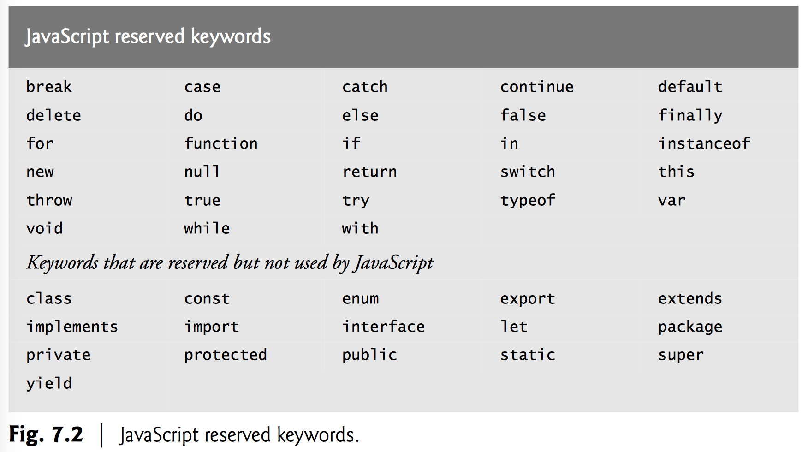
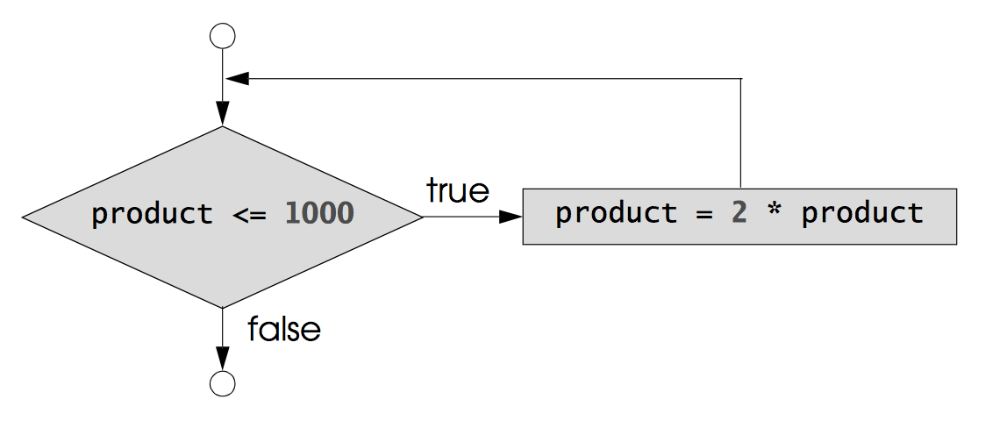
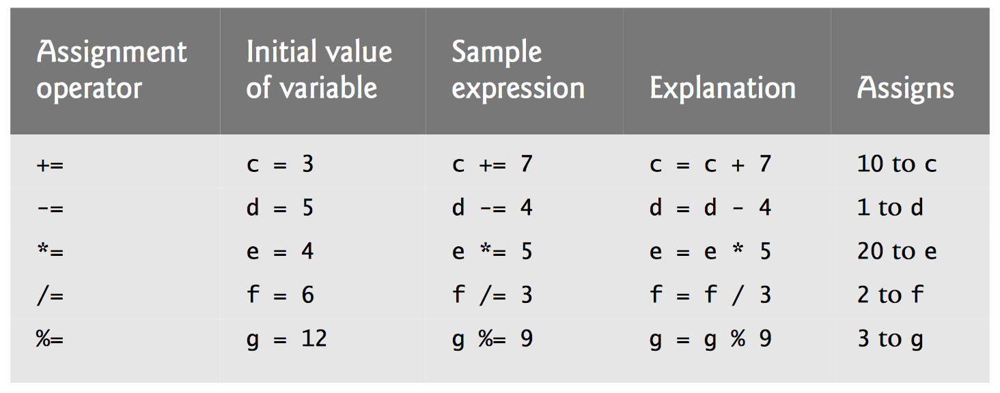
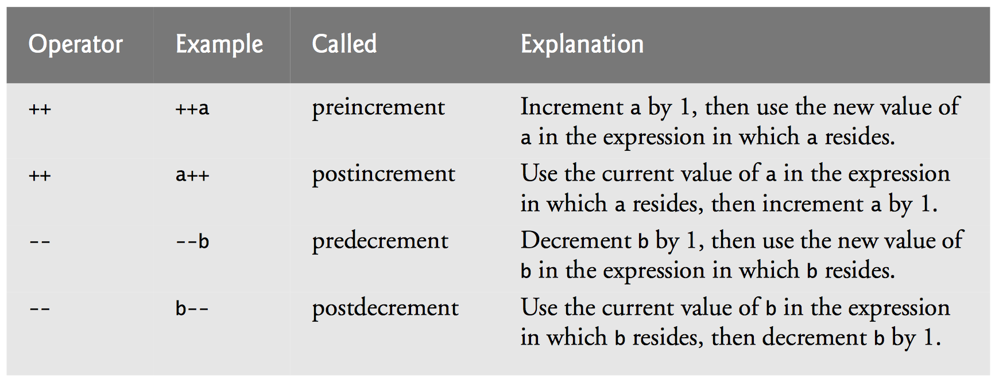

**GO OVER COMPOUND CONDITIONAL LEAP YEAR**

#Programming Background and Terminology

##Algorithm
* What is an algorithm?
    * A procedure for solving a problem. Consists of:
        1) The actions to be executed
        2) The order in which the actions are to be executed
    * Notice: this definition has nothing to do with a programming langague, program statements, etc.
        * We are abstracting away code into *problem solving*
* Pseudocode
    * A way to express the essence of an algorithm without using a programming language
    * Informally, it is a way to express what and how the algorithm does something, but doesn't specify syntax
    * Why is this useful?
        * Syntax is cumbersome, many trivial details of the code do not correspond to the overarching problem the algorithm solves
    * Example: Leap year

```text
if year is divisible by 400 then
  is_leap_year
else if year is divisible by 100 then
  not_leap_year
else if year is divisible by 4 then
  is_leap_year
else
  not_leap_year
```

* Notice we are just describing the logic behind the program without consideration of syntax
* Here's the pseudocode for out compound conditional version:

```text
if (year is divisible by 4 and not divisible by 100) or year is divisible by 400 then
  is_leap_year
else
  not_leap_year
```

##Control Statements
* Prior to the `if...else` statement, our programs executed sequentially
    * They executed from top to bottom
* `if...else` introduced *branching*, or a *conditional jump*, meaning the program would "choose a fork in the road" based on some boolean evaluation 
    * This enabled more powerful programs, since the state of particular variables can vary with each execution
    * `if...else` gave us control over what program statements to executes for cases we cared about
* History lesson: the `goto` statement
    * Instructed a program to jump to a particular line in the program
    * Think of a function: it's like a "goto the starting line of the called function" and terminates with a "goto to the next line of the calling function"
    * This is a largely deprecated programming practice
    * Enabled a "spaghetti programming" where a program was like a whole bunch of spaghetti laid out, with each piece of spaghetti representing a `goto` statement
* Now, imperative languages (Javascript, C, C++, Java, Python, ...) use *structed programming* that consists of three *control structures*
    1) *sequence structure* - execute the program linearly, one right after another
    2) *selection structure* - select or ignore a program statement (`if...else`)
    3) *repetition structure* - repeat the program statement(s) a certain number of times (`while, do...while, for, for...in`)
* We can model the control structure of a program with graphical models that show the control flow of the program
    * A flowchart of the possible program executions
    * Useful for modeling sub components of a program, but infeasible to model an entire program's execution
* Here's a good list of Javascript keywords, many of which are control statement related:


### `if` statement
* Already covered
* Important new terminology in terms of control flow:
    * `if` is a *single-selection* statement. It selects or ignores a single action (program statement(s))
    * We can think of an `if` statement as having a single entry point and single exit point

### `if...else` statement
* Already covered
* `if...else` is a *double-selection* statement
    * Selects among two actions

### Ternary Operator (Conditional Operator)
* We can shorthand the if else statement with a ternary operator of the following form:

```js
cond ? true_action : false_action
```

This allows us to shorthand if else's and make our code shorter. Consider the two following uses:

```js
document.writeln( student_grade >= 60 ? "Passed" : "Failed" ); // immediately using the result
courseResult = student_grade >= 60 ? "Passed" : "Failed";         // assignment to the result
```

* Differences with `if...else`
    * Ternary operator **returns** a value
    * This is how the above two examples work (collapse/evaluate the ternary to see...)
        * E.g. if `student_grade` was 50, this the same as calling `document.writeln("Failed");` or assigning `pass_fail = "Failed";`

### Dangling `else`'s
* We are permitted to write nested `if...else` statements
* We also don't have to include the curly braces `{}`, which start a **block statement**
    * Block statements are groupings of program statements
        * You can think of them like compound statements, in the same sense of compound conditionals
* Example block statement:

```js
var a1 = 3;
{ 
  var a2 = 5;
}
console.log(a1 + a2);
```

* This behavior is different from C/C++!
    * Block statements do not introduce **scope**
* Scope is the "lifetime of a variable"
    * When a variable/function goes out of scope, it is not valid to use that variable or function again
    * In the example above, an equivalent C/C++ code segement would fail to compile because a2 would be out of scope
        * The scope of a2 would be from its declaration to its closing curly brace
Back to why this matters for `if...else`...
* If we don't include the curly braces, we have an implicit block statement
    * But what problems might we encounter with nested `if...else`'s?


* Consider the following possibilities:

```js
if ( x > 5 ) 
  if ( y > 5 )
    document.writeln( "<p>x and y are > 5</p>" );
else
  document.writeln( "<p>x is <= 5</p>" );
```

```js
if ( x > 5 ) 
  if ( y > 5 )
    document.writeln( "<p>x and y are > 5</p>" );
  else
    document.writeln( "<p>x is <= 5</p>" );
```

* The second one is the right one.
    * We will match the most nested if to the next else.
        * Using block statements fixes this problem because it enforces which `if` the `else` belongs to
* Fix:

```js
if ( x > 5 ) 
{
  if ( y > 5 )
    document.writeln( "<p>x and y are > 5</p>" );
}
else
  document.writeln( "<p>x is <= 5</p>" );
```

* What about if we want multiple statements in one if?
* Consider the following:

```js
if ( grade >= 60 )
    document.writeln( "<p>Passed</p>" );
else 
    document.writeln( "<p>Failed</p>" ); 
    document.writeln( "<p>You must take this course again.</p>" );
```

* What's the problem?
    * The last line is not associated with the else!
* Fix:

```js
if ( grade >= 60 )
    document.writeln( "<p>Passed</p>" );
else 
{
    document.writeln( "<p>Failed</p>" ); 
    document.writeln( "<p>You must take this course again.</p>" );
}
```

* The main point: don't trust indentation!
    * Use explicit block statements (through curly braces)
        * You must use a block if   
        * I do this all the time, no matter. I personally believe it offers a cleaner, more consistent code style that has better defined semantics 
* Technical semantics (the actual logic here):
    * `if` and `else` will associate with the next statement
    * That statement can be a single program statement, or a compound statement
        * By making the next statement a block statement, we avoid the problem completely, even if we only execute one statement in that block statement.
            * Removes ambiguity in all cases while adding minimal amount of lines to your program (not that ever print source code anyway, so the length of your program doesn't really matter)

### Errors
* When debugging, we need to evaluate what is causing the problem in our program and how we can fix it
* Three main types of errors:
    * *Syntax errors* - invalid code. The compiler/interpreter cannot succesfully execute the program. Will be detected by the computer. Basically means you violated the rules of the language. Example: forgetting to put a closing curly brace at the end of an `if...else`.
    * *Semantic errors* - valid code, but does not produce the results you expect. Example: using the wrong variable or operator somewhere in your code
    * *Design errors* - valid code and produces the results you expect. However, your understanding of the problem is wrong. Example: using the wrong forumla for something.
* Semantic and design errors are very similar but have different implications for debugging
    * A semantic error means we understand the problem and need to adjust our code to reflect that understanding
    * A design error means we don't understand the problem and will never be able to produce a working program
* Clearly, a design error is a more significant problem than semantic error
* Ways to fix errors:
    * Syntax error: computer will usually give a hint as to what's causing the problem. Go inspect your code to see what might be wrong (generally easy, but can be incredibly frustrating)
    * Semantic error: assuming you have correct pseudocode, something in your program doesn't match the pseudocode. Compare the two and make sure the operations match up. This is when you facepalm and can't believe you've wasted an hour verifying your pseudocode matches your code but you mistyped a `+` for a `*`.
    * Design error: Your pseudocode is wrong. Fix the pseudocode first. There's no specific advice to give since this error is always problem-specific. This is when you email your professor/supervisor/customer for guidance.

### Repetition (loops)
* Repeat an action a number of times while a condition is true
* Example shopping pseudocode:

```text
While there are more items on my shopping list 
  Purchase next item and cross it off my list
```

* When the condition becomes false, the loop exits
* Critical part: the loop must do something that will eventually cause the condition to be false
    * Otherwise, we are stuck in an infinite loop!
* Example for shopping: 

```js
var shopping_list = ["pants", "grocercies", "car"];
var i = 0;
// purchase all items in the list
while(i < shopping_list.length)
{
  purchase(shopping_list[i]); // purchase the item
  i = i + 1;                  // move to the next item
}

function purchase(item){
  window.alert("Purchased " + item);
}
```

* If you think visually, consider the following code + flowchart

```js
var product = 2; 
while ( product <= 1000 )
{
  product = 2 * product;
}
```


* So we can think about a loop as a repeated cycle in a flowchart until a condition becomes false

* Exercise: 
    * Write pseudocode and javascript to average a class's scores on an exam. The program should prompt the user for the number of students in the class, then ask for each score. The scores should be printed nicely into a table with the average at the bottom.


* Pseudocode: 

```text
Set total to zero
Set grade counter to zero
Input number of students

Print table header

While grade counter is less than number of students
  Input the next grade
  Add the grade into the total
  Add one to the grade counter
  Print grade to table

Set the class average to the total divided by number of students
Print the class average to table
```

* Code:
    * See `class_average.html` 
    * Question: does this solution cover edge cases?


* Another exercise:

A college offers a course that prepares students for the state licensing exam for real estate brokers. Last year, 10 of the students who completed this course took the licensing exam. Naturally, the college wants to know how well its students performed. You’ve been asked to write a script to summarize the results. You’ve been given a list of these 10 students. Next to each name is written a 1 if the student passed the exam and a 2 if the student failed.

Your script should analyze the results of the exam as follows: 
1. Input each test result (i.e., a 1 or a 2). Display the message “Enter result” on the screen each time the script requests another test result. 
2. Count the number of test results of each type. 
3. Display a summary of the test results indicating the number of students who passed and the number of students who failed. 
4. If more than eight students passed the exam, print the message “Bonus to instructor!”


* Pseudocode:

```text
Initialize passes to zero
Initialize failures to zero
Initialize student to zero

While student counter is less than ten
  Input the next exam result
  If the student passed
    Add one to passes
  Else
    Add one to failures
  Add one to student counter

Print the number of passes
Print the number of failures

If more than eight students passed
  Print “Bonus to Instructor!”
```

* Code:
    * See `bonus.html`


### Assignment Operators
* Modifying a variable (changing its value) is extremely common. We have a shorthand way doing this:

```js
c = c + 3;
c += 3;     //same as above

```

* More generally, any statement of the form

```js
variable = variable operator expression;
```

Can always be written as 

```js
variable operator = expression;
// operator could be +, -, *, /, %
```



### Increment and decrement operators

* Key difference:
    * pre changes the value, then returns the new value
    * post returns the current value, then change the value
    * These operators break PEMDAS; they have a higher precedence than `*`, `/`, `%`
* Consider the following situation:

```js
var a = 10
var counter1 = 0;
var counter2 = 0;
while(counter1++ < a)
{
  // loop 1
}
while(++counter2 < a)
{
  // loop 2
}
console.log(counter1);
console.log(counter2);
```

* What will be the final value of `counter1` and `counter2`?


    * `counter1` will be 11 (loop 1 runs 10 times, but counter1 is incremented an extra time (postincrement))
    * `counter2` will be 10 (loop 2 runs 10 times)
    
### Additional Repetition Structures (loops)
* `for`
    * functionally equivalent to while
    * Structure:

```js
for(initialization_statement; loop_condition; loop_end_statement)
{
  // loop body
}
// in practice
for (var i = 0; i < 10; i++){
  
}
// which is the same as
var i = 0;
while (i < 10){
  i++;
}
```

* `do...while`
    * Like a while loop, but guarantees that the loop will execute at least once
    * Condition is checked at the end of the loop

```js
var i = 0;
do {
  // loop body
  i++;
} 
while(i < 10);
```

* `for...in`
    * Will be discussed after JSON 

 

 


